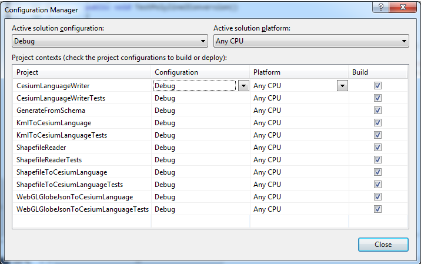
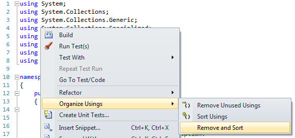

We are a community that encourages contributions. Join us.  Here, we detail how to get, build, develop, and contribute code.

## Getting the Code

Short version:
* No commit access? Fork and clone [cesium](https://github.com/AnalyticalGraphicsInc/cesium).
* Commit access? Clone [czml-writer](https://github.com/AnalyticalGraphicsInc/czml-writer) and make all non-trivial changes in a branch.

Details:
* [Setup git on Windows](http://help.github.com/win-set-up-git/) if it isn't already.
   * On Windows, `git config --global core.autocrlf true` (following the instructions above does this for you).  
   * Other recommended Git settings:
      * `git config --global push.default upstream` - when running `git push`, only push the current branch.
      * `git config --global branch.autosetuprebase always` - when pulling remote changes, rebase your local changes on top of the remote changes, to avoid unnecessary merge commits.
* Have commit access to czml-writer?
   * No
      * Fork [czml-writer](https://github.com/AnalyticalGraphicsInc/czml-writer).
      * Create a local repo of your fork, e.g., `git clone git@github.com:yourusername/czml-writer.git`
   * Yes
      * Create a local czml-writer repo, e.g., `git clone git@github.com:AnalyticalGraphicsInc/czml-writer.git`
      * Make non-trivial changes in a branch, e.g., `git branch myfeature`, and then `git checkout myfeature`

## Building the Code

Building the code is easy.

C#:
* Open the solution **DotNet/CesiumLanguageWriter.sln** in [Visual Studio](http://www.microsoft.com/visualstudio/en-us).

* From the build menu, select _Build -> Configuration Manager.._. and make sure all of the projects to be built are checked. 

* Select _Build -> Build Solution_ from the build menu or use the keyboard shortcut **ctrl + shift + B** to build all of the target projects.

## Development Tips and Conventions

* Place each new CZML converter in a new project, noting the source type in the project name (e.g. KmlToCesiumLanguage).

* Place the unit tests for each writer in a new project, which should be named by appending the word "Tests" to the existing project name (e.g. KmlToCesiumLanguageTests).

* When **using CesiumLanguageWriter**, make sure to include a reference to the project. In the Solution Explorer (_View -> Solution Explorer_), expand the project tree, right-click _References_ and select _Add Reference..._. In the window that appears, click the Projects tab, select _CesiumLanguageWriter_ and hit OK.

* Clean up using statements. To do so, right-click in the editor and select _Organize Usings -> Remove and Sort_

## Contributing Code

* Send us a [pull request](http://help.github.com/send-pull-requests/).  We'll promptly [review](https://github.com/AnalyticalGraphicsInc/cesium/wiki/Code-Review-Tips) it, provide feedback, and merge it.
* Before we can merge, we require a [Contributor License Agreement](http://producingoss.com/en/copyright-assignment.html#copyright-assignment-cla) (CLA).  This can be emailed to cla@agi.com, and only needs to be completed once.  The CLA ensures that you retain copyright to your contributions, and that we have the right to use them.  There is a CLA for [individuals](http://www.agi.com/licenses/individual-cla-agi-v1.0.txt) and [corporations](http://www.agi.com/licenses/corporate-cla-agi-v1.0.txt).  Please email completed CLAs and related questions to cla@agi.com.
* Please make sure
   * Your code produces no errors or warnings at build time.
   * To include tests with excellent code coverage for any new features.  We use [Nunit](http://www.nunit.org/) for writing tests.  Verify all new and existing tests pass. 
   * To include reference documentation with code examples when adding new public functions and attributes. We use [C#'s XML Documentation Comments](http://msdn.microsoft.com/en-us/library/b2s063f7).
   * To update [LICENSE.md](https://github.com/AnalyticalGraphicsInc/czml-writer/blob/master/LICENSE) if third-party libraries were added or removed.
* If you have commit access, delete the branch if you are no longer using it.