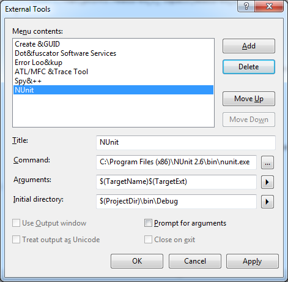

We are a community that encourages contributions. Join us.  Here, we detail how to get, build, develop, and contribute code for writing CZML.

## Getting the Code

Short version:
* No commit access? Fork and clone [czml-writer](https://github.com/AnalyticalGraphicsInc/czml-writer).
* Commit access? Clone [czml-writer](https://github.com/AnalyticalGraphicsInc/czml-writer) and make all non-trivial changes in a branch.

Details:
* Setup git if it isn't already ([linux](http://help.github.com/linux-set-up-git/) | [mac](http://help.github.com/mac-set-up-git/) | [windows](http://help.github.com/win-set-up-git/)).
   * On Windows, `git config --global core.autocrlf true` (following the instructions above does this for you).  
   * On Linux/Mac, `git config --global core.autocrlf input` - see the [GitHub help on this topic](http://help.github.com/line-endings/).
   * Other recommended Git settings:
      * `git config --global push.default upstream` - when running `git push`, only push the current branch.
      * `git config --global branch.autosetuprebase always` - when pulling remote changes, rebase your local changes on top of the remote changes, to avoid unnecessary merge commits.
* Have commit access to czml-writer?
   * No
      * Fork [czml-writer](https://github.com/AnalyticalGraphicsInc/czml-writer).
      * Create a local repo of your fork, e.g., `git clone git@github.com:yourusername/czml-writer.git`
   * Yes
      * Create a local czml-writer repo, e.g., `git clone git@github.com:AnalyticalGraphicsInc/czml-writer.git`
      * Make non-trivial changes in a branch, e.g., `git branch myfeature`, and then `git checkout myfeature`

## Building the Code

Building the code is easy.

C#:
* Open `DotNet/CesiumLanguageWriter.sln` in Visual Studio (or [MonoDevelop](http://monodevelop.com/)).

* Select Build - Build Solution (Ctrl + Shift + B) to build all projects.

Java:
* Open the projects in [Eclipse](http://www.eclipse.org/):
	* File - Import - General - Existing Projects into Workspace
	* Select root directory: `\czml-writer\Java`
* Project - Build All (Ctrl + B)
	* Or select Project - Build Automatically to build when changes are saved.

## Running Unit Tests
**MonoDevelop:**
* Choose a test project or file from the solution view and select Run - Run Unit Tests (Ctrl + T)

**Eclipse:**
* In the Package or Project Explorer (Window - Show View), right-click the test project or file and select Run-As - [Junit](http://www.junit.org/) Test

**Using NUnit with Visual Studio:**
* Download and install the latest version of [Nunit](http://www.nunit.org/)
* Tools - External Tools, Add 'NUnit' and fill out the following fields:

* View - Toolbars - Customize
* New - Enter 'NUnit Tools'. 
* On the Commands tab, add the external command (the command number corresponds to the position of NUnit in the External Tools list shown above).

* Click the NUnit button in the new toolbar to start the NUnit GUI and load the current test suite.
* To debug tests within Visual Studio, Debug - Attach To Process... - nunit-agent.exe

## Development Tips and Conventions

* Place each new CZML converter in a new project.  Include the source format in the project name, e.g. `KmlToCesiumLanguage`.

* Place unit tests for each writer in a new project, named by appending `Tests` to the corresponding project name, e.g. `KmlToCesiumLanguageTests`.

* When `using CesiumLanguageWriter`, make sure to include a reference to the project. In the Solution Explorer (View - Solution Explorer), expand the project tree, right-click References and select Add Reference. In the window that appears, click the Projects tab, select `CesiumLanguageWriter` and hit OK.

* To cleanup unused using statements, right-click in the editor and select Organize Usings - Remove and Sort

## Contributing Code

* Send us a [pull request](http://help.github.com/send-pull-requests/).  We'll promptly [review](https://github.com/AnalyticalGraphicsInc/cesium/wiki/Code-Review-Tips) it, provide feedback, and merge it.
* Before we can merge, we require a [Contributor License Agreement](http://producingoss.com/en/copyright-assignment.html#copyright-assignment-cla) (CLA).  This can be emailed to cla@agi.com, and only needs to be completed once.  The CLA ensures that you retain copyright to your contributions, and that we have the right to use them.  There is a CLA for [individuals](http://www.agi.com/licenses/individual-cla-agi-v1.0.txt) and [corporations](http://www.agi.com/licenses/corporate-cla-agi-v1.0.txt).  Please email completed CLAs and related questions to cla@agi.com.
* Please make sure
   * Your code builds without errors or warnings.
   * To include tests with excellent code coverage for any new features.  We use [Nunit](http://www.nunit.org/) for writing tests.  Verify all new and existing tests pass. 
   * To include reference documentation with code examples when adding new public functions and attributes. We use [C#'s XML Documentation Comments](http://msdn.microsoft.com/en-us/library/b2s063f7).
   * To update [LICENSE.md](https://github.com/AnalyticalGraphicsInc/czml-writer/blob/master/LICENSE) if third-party libraries were added or removed.
* If you have commit access, delete the branch if you are no longer using it.