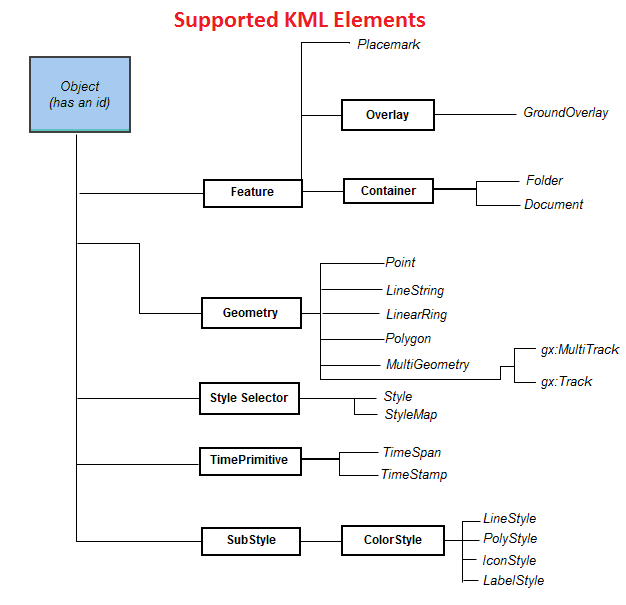
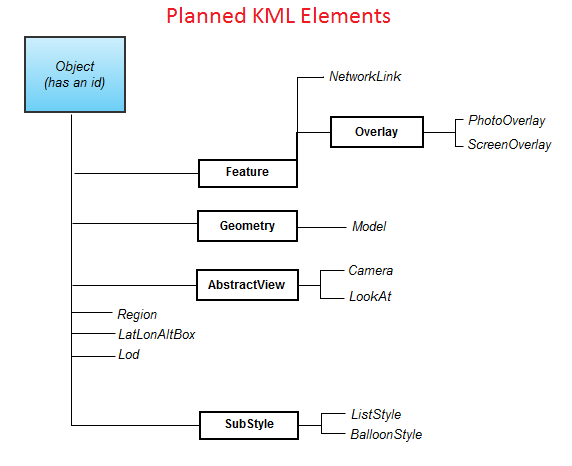

## <a name="Feature">Feature</a>
Supported:  
`<name>`  
`<visibility>`  
`<TimePrimitive>`  
`<styleUrl>`  
`<StyleSelector>`  
## <a name="Placemark">Placemark</a>
inherited from <a href="#Feature">Feature</a> element.  
Supported:  
`<Geometry>`  
## <a name="NetworkLink">NetworkLink</a>
Planned to be supported.
## <a name="Overlay">Overlay</a>
inherited from <a href="#Feature">Feature</a> element.  
Supported:  
`<color>`  
`<Icon>  
  <href/>  
</Icon>`  
## <a name="GroundOverlay">GroundOverlay</a>
inherited from <a href="#Feature">Feature</a> element.  
inherited from <a href="#Overlay">Overlay</a> element.  
Supported:  
`<altitude>`  
`<altitudeMode>(clampToGround and absolute)`  
`<LatLonBox>`  
## <a name="PhotoOverlay">PhotoOverlay</a>
Planned to be supported.
## <a name="ScreenOverlay">ScreenOverlay</a>
Planned to be supported.
## <a name="Geometry">Geometry</a>
Supported.
## <a name="Point">Point</a>
Supported:  
`<extrude>`  
`<altitudeMode>(clampToGround, absolute)`  
`<coordinates>`  
## <a name="LineString">LineString</a>
Supported:  
`<altitudeMode>(clampToGround, absolute)`  
`<coordinates>`  
Not supported:  
`<extrude>`  
`<tessellate>`  
## <a name="LinearRing">LinearRing</a>
Currently being worked on.
## <a name="Polygon">Polygon</a>
Supported:  
`<altitudeMode>(clampToGround, absolute)`  
`<outerBoundaryIs>
  <LinearRing>
    <coordinates>
  </LinearRing>
</outerBoundaryIs>`  
Not supported:  
`<extrude>`  
`<tessellate>`  
`<innerBoundaryIs>`  
## <a name="MultiGeometry">MultiGeometry</a>
A container for zero or more geometry primitives. Supported.
## <a name="Model">Model</a>
Planned to be supported.
## <a name="AbstractView">AbstractView</a>
Planned to be supported.
## <a name="Camera">Camera</a>
Planned to be supported.
## <a name="LookAt">LookAt</a>
Planned to be supported.
## <a name="Region">Region</a>
Planned to be supported.
## <a name="LatLonAltBox">LatLonAltBox</a>
Planned to be supported.
## <a name="Lod">Lod</a>
Planned to be supported.
## <a name="StyleMap">StyleMap</a>
Supported:  
`<Pair id="ID">
  <key>
  <styleUrl/> or <Style/>
</Pair>`  
## <a name="TimeSpan">TimeSpan</a>
Supported:  
`<begin/>`  
`<end/>`  
## <a name="TimeStamp">TimeStamp</a>
Supported:  
`<when/>`  
## <a name="BalloonStyle">BalloonStyle</a>
Planned to be supported.
## <a name="ColorStyle">ColorStyle</a>
Supported:  
`<color>`  
Not supported:  
`<colorMode>`  
## <a name="LineStyle">LineStyle</a>
Inherited from <a href="#ColorStyle">ColorStyle</a>.  
Supported:  
`<width>`  
## <a name="ListStyle">ListStyle</a>
Planned to be supported.
## <a name="PolyStyle">PolyStyle</a>
Inherited from <a href="#ColorStyle">ColorStyle</a>. 
Supported:  
`<fill>`  
`<outline>`  
## <a name="IconStyle">IconStyle</a>
Inherited from <a href="#ColorStyle">ColorStyle</a>.  
Supported:  
`<scale>`  
`<Icon>
  <href/>
</Icon>`  
Not supported:  
`<heading>`  
`<hotSpot>`  
## <a name="LabelStyle">LabelStyle</a>
Inherited from <a href="#ColorStyle">ColorStyle</a>. 
Supported:  
`<scale>`  