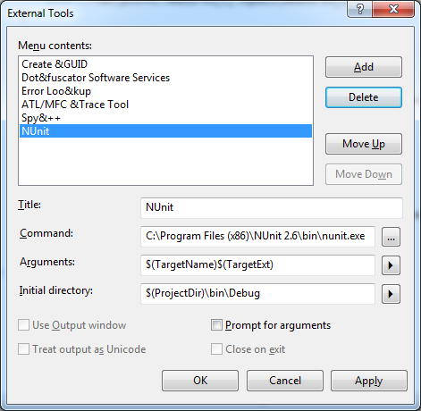
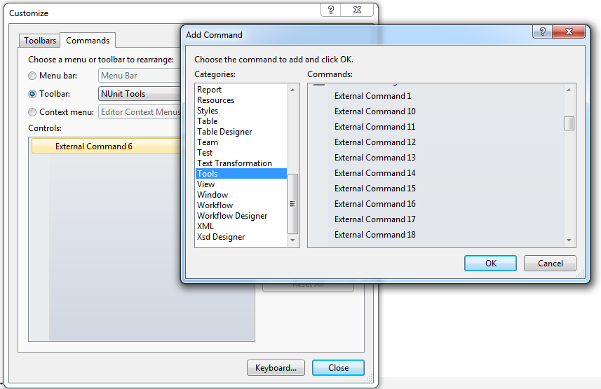

## Get the Code

* `git clone git@github.com:AnalyticalGraphicsInc/czml-writer.git`
	* Or download the [zip](https://github.com/AnalyticalGraphicsInc/czml-writer/zipball/master)

## .NET

* Open `DotNet\CesiumLanguageWriter.sln`
	* On Windows, use [Visual Studio 2010](http://www.microsoft.com/visualstudio/en-us/products/2010-editions), [Visual Studio 2010 Express](http://www.microsoft.com/visualstudio/en-us/products/2010-editions/express), or newer.
	* On Linux and Mac, use [MonoDevelop](http://monodevelop.com/).
* Build the included projects
	* Visual Studio:  Build - Build Solution (Ctrl + Shift + B)
	* MonoDevelop:  Build - Build All (F8)
* Run the unit tests:
	* Visual Studio: 
		* Download and install the latest version of [Nunit](http://www.nunit.org/)
		*  Tools - External Tools, Add 'NUnit' and fill out the following fields:
		
		* View - Toolbars - Customize
		* New - Enter 'NUnit Tools'. 
		* On the Commands tab, add the external command (the command number corresponds to the position of NUnit in the External Tools list shown above).
		
		* Click the NUnit button in the new toolbar to start the NUnit GUI and load the current test suite.
		* To debug tests within Visual Studio, Debug - Attach To Process... - nunit-agent.exe
	* MonoDevelop:  Choose a test project or file from the solution view and select Run - Run Unit Tests (Ctrl + T)

##Java:

* In [Eclipse](http://www.eclipse.org/)
	* File - Import - General - Existing Projects into Workspace
	* Select root directory: `\czml-writer\Java`
* Build the included projects:
	* Project - Build All (Ctrl + B)
	* Or select Project - Build Automatically to build when changes are saved.
* Run the unit tests:
	* In the Package or Project Explorer (Window - Show View), right-click the test project or file and select Run-As - [Junit](http://www.junit.org/) Test